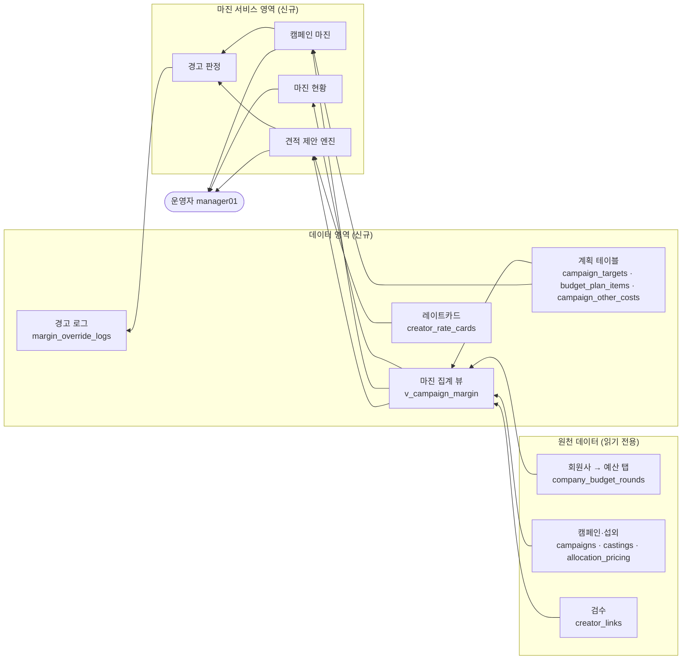

# Boarding Pass — 마진 관리(Margin) 기능 기획서

| 항목 | 내용 |
| --- | --- |
| 문서 버전 | v0.5 |
| 작성일 | 2026-09-16 |
| 대상 시스템 | Boarding Pass 운영 콘솔 `/admin` |
| 저장소 | `kjh-dev-sweet4pot/BoardingPass_Demo` · 브랜치 `v1.2.1` |
| 개발 범위 | 1단계 마진 관리 / 2단계 크리에이터–캠페인 배치 관리 |
| 목표 일정 | 1단계 2일, 2단계 2~3일 |

---

## 1. 문서의 목적

캠페인 예산과 마진율을 담당자 1명이 수기로 계산하는 현재 방식을 시스템으로 옮긴다. 이 문서는 무엇을 화면에 보여주고, 어떤 값을 저장하며, 어떤 조건에서 어떤 동작이 일어나는지를 정의한다. 디자인 시안은 이 문서의 범위가 아니다.

### 1.1. 해결하려는 문제

1. 마진율 계산이 특정 담당자에게 집중되어 있고, 건별로 대표 컨펌을 거친다.
2. 캠페인 예산 대비 집행 현황을 실시간으로 볼 수 있는 화면이 없다.
3. 목표 발행량과 예산 사용 계획이 문서 밖(엑셀·메신저)에 흩어져 있다.
4. 크리에이터 단가 기준이 시스템에 없어 매번 문의가 발생한다.

### 1.2. 범위에 포함되지 않는 것

- 재무 대시보드(입금·마진·지급 현황, 송금 캘린더). 별도 모듈로 분리해 개발하며 차후 결합을 전제로 데이터 키만 맞춰 둔다.
- 회원사 콘솔(`/com`, `/inf`, `/phar`)의 화면 변경. **원가·마진 관련 값은 회원사 화면에 어떤 형태로도 노출하지 않는다.**
- 실제 송금·회계 처리.
- 외화·환율 처리. 모든 금액은 KRW 정수, VAT 제외로 고정한다.

---

## 2. 전제 조건

기존 코드 및 운영 방식에서 확정된 사실이다. 이 전제가 바뀌면 3장 이하가 모두 영향을 받는다.

| # | 전제 |
| --- | --- |
| P1 | 크리에이터 단가 협상은 Boarding Pass 밖에서 진행한다. 시스템은 **협상 결과 금액만 입력**받는다. `castings.status`의 `Nego`와 `negotiation_logs`는 기록용이며, 마진 계산은 `Nego` 값을 쓰지 않는다. |
| P2 | 예산 원본은 `company_budget_rounds` 테이블이며, `/admin → 회원사 → 예산` 탭이 소유한다. 마진 관리는 이 데이터를 **읽기만** 하고 생성·수정하지 않는다. |
| P3 | 실무자는 `manager01`(admin_manager) 계정을 사용한다. 권한 정책은 변경하지 않으며, 마진 관리 탭은 `admin_manager` 전용이다. |
| P4 | 원가·매출 금액은 모두 KRW 정수, VAT 제외다. |
| P5 | 집행(원가) 인식 시점은 **콘텐츠 발행완료 시점**이다. |
| P6 | 발행량은 **실제 게시된 URL 수**다. |

---

## 3. 용어사전

같은 개념에 두 단어를 쓰지 않는다. 코드·DB·화면 모두 아래 용어를 따른다.

| 용어 | 영문/컬럼 | 정의 |
| --- | --- | --- |
| 회원사 | Company / `companies` | 광고주. 기존 엔티티. |
| 캠페인 | Campaign / `campaigns` | 회원사 1개에 속한 집행 단위. 회원사 1 : 캠페인 N. 기존 엔티티. |
| 크리에이터 | Influencer / `influencers` | 콘텐츠 제작자. 문서·화면에서 "인플루언서" 대신 **크리에이터**로 통일한다. |
| 캐스팅 | Casting / `castings` | 캠페인에 크리에이터를 붙인 기록. 기존 엔티티. |
| 배정 | Allocation / `allocations` | 캐스팅 확정(Accept) 시 생성되는 실행 단위. 기존 엔티티. |
| 콘텐츠 | CreatorLink / `creator_links` | 크리에이터가 제출·발행한 게시물 1건. 기존 엔티티. |
| 입금 라운드 | DepositRound | `company_budget_rounds` 중 `kind = '입금'`인 행. 회원사가 실제로 입금하는 단위. 차수는 `label`, 입금 월은 `period_month` |
| 사용 분할 | UsageRound | `company_budget_rounds` 중 `kind = '사용'`인 행. 입금 라운드 1건을 월별 사용 계획으로 쪼갠 것. `source_deposit_id`로 부모 입금 행에 연결된다 |
| 가용 예산 | Balance | `입금 완료 합계 − 사용 합계`. 기존 `summarizeCashflow()`가 계산한다 |
| 캠페인 예산 | `campaigns.budget_amount` | 캠페인에 배분된 금액. **노출가 기준이며 이 값이 매출 인식액이다.** 기존 컬럼 |
| 노출가 | `allocation_pricing.display_price` | 회원사에 청구하는 캐스팅 단가. 기존 컬럼 |
| 목표 발행량 | PublishTarget | 캠페인에서 달성해야 할 게시물 수. **신규** |
| 슬롯 | BudgetPlanItem | 예산 사용 계획의 최소 단위. `티어 × 단가 × 개수`. **신규** |
| 원가 | Cost | 캠페인 매출에서 차감하는 금액. 운영자가 입력한 값의 합계이며, 그 외 계산은 하지 않는다. |
| 크리에이터 소요비용 | CreatorCost | 크리에이터에게 지급하기로 한 금액. `allocation_pricing.cost_amount` |
| 기타 소요비용 | OtherCost | 크리에이터 지급액 외에 운영자가 직접 입력한 금액. **신규** |
| 마진율 | MarginRate | `(매출 − 원가) ÷ 매출 × 100`. 단위는 %. |
| 레이트카드 | RateCard | 크리에이터별 표준 단가 목록. **신규** |
| 비용 분할 | CostSplit | 1명의 크리에이터 지급액을 여러 캠페인에 나누는 기록. **신규(2단계)** |

---

## 4. 마진 계산 규칙

기획서에서 가장 중요한 부분이다. 아래 정의 외의 계산식은 사용하지 않는다.

### 4.1. 공식

```
매출(Revenue)   = campaigns.budget_amount (노출가 기준 캠페인 예산, VAT 제외)
원가(Cost)      = 크리에이터 소요비용 합계 + 기타 소요비용 합계
이윤(Profit)    = 매출 − 원가
마진율(MarginRate) = (매출 − 원가) ÷ 매출 × 100
```

원가는 **운영자가 입력한 값의 단순 합계**다. 판관비·인건비를 별도로 배부하거나 추정하지 않는다. 실제로 그런 비용이 들었다면 운영자가 그 금액을 포함해 입력한다. 따라서 마진율은 캠페인당 **하나만** 존재한다.

화면 문구 규칙: 확정된 지출은 `원가`, 아직 집행 전인 추정·제안 금액(견적 제안, 슬롯 계획)은 **`소요 비용`**으로 표기한다.

- 목표 마진율: **70%**
- 허용 범위: **±10%p → 60% ~ 80%**
- 소수점: 마진율은 소수점 1자리까지 계산하고, 화면에는 반올림해 정수 %로 표시한다. (예: `64.38` → `64%`)
- 매출이 0이거나 미입력이면 마진율은 계산하지 않고 화면에 `—`로 표시한다.

#### 4.1.1. 참고 지표 — 집행률

매출은 계획 예산으로 고정한다. 다만 실제 청구액(Accept 캐스팅의 노출가 합)이 예산과 얼마나 벌어졌는지는 확인할 수 있어야 하므로 참고 지표를 둔다. **이 값은 마진율 계산에 들어가지 않는다.**

```
집행 노출가 = SUM(allocation_pricing.display_price) where casting.status = 'Accept'
집행률 = 집행 노출가 ÷ campaigns.budget_amount × 100   ← 기존 spend_pct 와 동일
```

- 캠페인 마진 화면에 `집행률 92%` 형태로 한 줄 표시한다
- 90% 미만 또는 110% 초과이면 문구를 덧붙인다: `예산과 집행 노출가가 {금액}만원 차이납니다.`
- `admin-dashboard`가 `margin = 노출가합 − 원가합`을 계산하고 있다. 이것은 마진 관리의 마진율과 분모가 다르므로 **KPI 라벨을 `집행 기준 마진`으로 바꿔** 두 숫자가 같은 것으로 오해되지 않게 한다

### 4.2. 계산 예시

배분예산 10,000,000원 캠페인:

| 항목 | 금액 | 비고 |
| --- | --- | --- |
| 매출 | 10,000,000 | `campaigns.budget_amount` |
| 크리에이터 소요비용 | 2,400,000 | 확정 캐스팅 12건 합계 |
| 기타 소요비용 | 600,000 | 운영자 직접 입력 (광고비 400,000 + 상품 제공가 200,000) |
| 원가 합계 | 3,000,000 | |
| 이윤 | 7,000,000 | |
| **마진율** | **70.0%** | 목표 충족 |

### 4.3. 원가 3종 구분

같은 캠페인의 원가라도 시점에 따라 세 가지 숫자가 나온다. 화면에서 반드시 구분해 표시한다.

| 이름 | 정의 | 집계 조건 |
| --- | --- | --- |
| 계획원가 | 슬롯 계획의 합계 | `budget_plan_items` 의 `unit_cost × slot_count` 합 |
| 약정원가 | 캐스팅이 확정된 금액의 합계 | `castings.status = 'Accept'` 인 배정의 `allocation_pricing.cost_amount` 합 |
| 확정원가 | 콘텐츠가 실제 발행된 건에 대응하는 금액의 합계 | 아래 4.4 규칙 |

- **대표 마진율(화면 상단·목록의 게이지)은 `약정원가` 기준으로 계산한다.** 운영 중 의사결정에 쓰이는 값이기 때문이다.
- `확정원가` 기준 마진율은 캠페인 상세에서 함께 표시한다. 캠페인 종료 시 최종 실적이 된다.

### 4.4. 확정원가 인식 규칙

배정 1건의 크리에이터 원가를 `C`, 목표 콘텐츠 수를 `T`(`allocations.target_content_count`), 발행완료 콘텐츠 수를 `P`라 한다.

```
발행완료 판정: creator_links.content_status = '발행완료' AND publish_url IS NOT NULL
P = 해당 배정에 속한 발행완료 콘텐츠 수
확정원가 = T > 0 ? C × min(P, T) / T : 0
```

- `P > T`(초과 발행)여도 확정원가는 `C`를 넘지 않는다.
- `T = 0`이면 확정원가는 0으로 둔다.

### 4.4a. 집계 대상 캠페인

| 캠페인 상태 | 마진 집계 |
| --- | --- |
| `견적수립` | 포함. 계획 기준 값만 잡힌다 |
| `시행` | 포함 |
| `결과` | 포함 |
| `보류` | **포함**. 집행이 재개될 수 있으므로 원가를 살려 둔다 |
| `취소` | **제외**. 매출·원가 모두 0으로 취급하며, 회원사 단위 합산에서도 빠진다 |

`취소`로 전환된 캠페인의 `campaigns.budget_amount`는 지우지 않는다. 마진 집계에서만 제외하며, 회원사 가용 예산 계산에서도 해당 캠페인 예산을 빼서 잔액이 즉시 복원되도록 한다.

### 4.5. 예산 소진율

```
예산 소진율(BurnRate) = 약정원가 ÷ (캠페인 예산 × 0.30) × 100
```

목표 마진 70%는 곧 "원가가 매출의 30%를 넘지 않는다"는 뜻이므로, 허용 원가 한도를 분모로 삼는다. 소진율 100%가 마진율 70% 지점과 정확히 일치한다.

---

## 5. 시스템 아키텍처

### 5.1. 영역 구분

| 영역 | 구성 | 소유권 |
| --- | --- | --- |
| 운영자 | `manager01` (admin_manager) | — |
| 마진 서비스 영역 | 마진 현황 · 캠페인 마진 · 견적 제안 엔진 · 경고 판정 | **신규** |
| 데이터 영역 | `v_campaign_margin` 뷰, 계획 테이블 5종 | **신규** |
| 원천 데이터 | 회원사 예산 탭 · 캠페인·섭외 · 검수 | 기존. 마진 모듈은 **읽기만** 한다 |

이 시스템에는 적재(ETL) 파이프라인이 없다. 원천 데이터가 이미 운영 중인 Supabase 테이블이므로, 집계 뷰가 조회 시점에 조인한다. 원천 → 데이터 → 서비스 방향의 단방향 흐름이며, 반대 방향으로 쓰는 것은 `margin_override_logs`(경고 무시 사유) 하나뿐이다.

### 5.2. 데이터 흐름



### 5.3. 마진 계산 경로

값 하나가 어디서 와서 어떻게 합쳐지는지의 경로다. 이 경로 밖에서 마진율을 계산하는 코드를 만들지 않는다.

| 단계 | 입력 | 처리 | 출력 |
| --- | --- | --- | --- |
| 1 | `campaigns.budget_amount` | 그대로 사용 | 매출 |
| 2 | `castings.status = 'Accept'` → `allocation_pricing.cost_amount` | 캠페인별 합계 | 약정원가 |
| 3 | `creator_links.content_status = '발행완료'` + `allocations.target_content_count` | 4.4 규칙 | 확정원가 |
| 4 | `campaign_other_costs.amount` | 캠페인별 합계 | 기타 소요비용 |
| 5 | 1 − (2 + 4) | 4.1 공식 | **마진율** |
| 6 | 5의 결과 | 7.2 구간 판정 | 색상·경고 |
| 7 | 6이 경고일 때 | 사유 입력 요구 | `margin_override_logs` |

### 5.4. 호출 흐름 — 캐스팅 확정 시

캐스팅 확정은 원가가 늘어나는 유일한 지점이므로 별도로 적는다.

1. 운영자가 `캠페인·섭외` 탭에서 캐스팅 확정 모달을 연다
2. 원가를 입력하면 **클라이언트가** 즉시 마진율을 재계산해 미리보기를 표시한다 (서버 호출 없음)
3. 결과가 60~80%를 벗어나면 사유 입력칸이 나타나고, 사유가 비면 확정 버튼이 비활성 상태가 된다
4. 확정 시 기존 `admin-casting-accept` 로직이 `allocations` + `allocation_pricing`을 생성한다
5. 같은 트랜잭션에서 경고가 있었다면 `margin_override_logs`를 1건 기록한다
6. 마진 현황·캠페인 마진 화면은 다음 조회 시 `v_campaign_margin`을 통해 갱신된 값을 읽는다

---

## 6. 정보 구조 (IA)

### 6.1. 전체 사이트맵 (신규 영역만 확장)

```
/admin  (운영 콘솔 · 드롭다운 그룹 네비게이션)
├─ 대시보드
├─ 성과            ├ 성과 대시보드 / 성과 조회
├─ 회원사          ├ 목록 / 요약 / 등록 / 예산 / 계약·인보이스 / 메일 발송
│                     └ 예산 탭 = company_budget_rounds 원본 (마진 관리는 읽기만)
├─ 인플루언서      ├ 등록 / 검수 / 배정·매장
├─ 캠페인·섭외
└─ 마진            ★ 신규 그룹 · admin_manager 전용
   ├ 마진 현황     marginOverview   캠페인별 마진·집행 목록
   ├ 캠페인 마진   marginCampaign   예산/목표/슬롯/배치/기타 소요비용
   ├ 견적 제안     marginQuote      목표·예산 → 슬롯 조합 산출
   ├ 레이트카드    marginRateCard   크리에이터 표준 단가
   └ 브랜드 롤업   marginRollup     회원사 단위 합산 (2단계)
```

회원사 예산 화면을 마진 그룹에 다시 만들지 않는다. 기존 `회원사 → 예산` 탭을 그대로 쓰고, 마진 현황에서 회원사명을 누르면 그 탭으로 보낸다.

### 6.2. 네비게이션 구현 방식

기존 `src/components/admin-sidebar-nav.tsx`는 `AdminSection` 유니온 + 그룹별 `NavDropdownItem` 배열 구조다. 같은 패턴으로 그룹 하나를 추가한다.

```ts
export type AdminSection =
  | "dashboard" | "performance" | "performanceLookup"
  | "companies" | "companiesOverview" | "companiesRegister"
  | "companiesMail" | "companiesDocs" | "companiesBudget"
  | "influencersRegister" | "influencersReview" | "influencersAlloc"
  | "campaigns"
  // 추가
  | "marginOverview" | "marginCampaign" | "marginQuote"
  | "marginRateCard" | "marginRollup";

export const MARGIN_NAV: NavDropdownItem<
  "marginOverview" | "marginCampaign" | "marginQuote" | "marginRateCard" | "marginRollup"
>[] = [
  { id: "marginOverview", label: "마진 현황",  hint: "캠페인별 마진·집행" },
  { id: "marginCampaign", label: "캠페인 마진", hint: "예산·목표·슬롯" },
  { id: "marginQuote",    label: "견적 제안",  hint: "목표 기준 슬롯 산출" },
  { id: "marginRateCard", label: "레이트카드", hint: "크리에이터 표준 단가" },
  { id: "marginRollup",   label: "브랜드 롤업", hint: "회원사 합산 마진" },  // 2단계
];
```

- 사이드바에서 **캠페인·섭외 다음, 가장 아래**에 배치한다.
- `admin_manager`가 아닌 세션에서는 그룹 자체를 렌더링하지 않는다. API 레벨에서도 별도 차단한다(→ 11장).
- 모바일 `MOBILE` 배열에는 `marginOverview` 1개만 `마진` 라벨로 추가한다.
- 내부 이동은 쿼리 파라미터로 상태를 유지한다. 새로고침·뒤로가기 시 화면이 보존되어야 한다.

| 화면 | URL |
| --- | --- |
| 마진 현황 | `/admin?section=marginOverview` |
| 캠페인 마진 | `/admin?section=marginCampaign&id={campaignId}&tab={summary\|plan\|castings\|costs}` |
| 견적 제안 | `/admin?section=marginQuote&campaign={campaignId}` |
| 레이트카드 | `/admin?section=marginRateCard` |
| 브랜드 롤업 | `/admin?section=marginRollup` (2단계) |
| (참조) 회원사 예산 | `/admin?section=companiesBudget&company={companyId}` — 기존 화면 |

### 6.3. 화면 간 이동 경로

```
마진 현황 ──(캠페인 행 클릭)──▶ 캠페인 마진
   │                                │
   │                                ├─(예산 확인 버튼)──▶ 회원사 → 예산 탭 (기존 화면)
   │                                ├─(견적 제안 버튼)──▶ 견적 제안
   │                                └─(크리에이터명 클릭)▶ 레이트카드 (해당 행 하이라이트)
   │
   ├─(위험 배지 클릭)──────────▶ 마진 현황 (필터=위험만)
   └─(회원사명 클릭)───────────▶ 회원사 → 예산 탭 (해당 회원사)

캠페인·섭외 ─(캐스팅 확정 모달)─▶ 마진 실시간 미리보기 (인라인, 화면 이동 없음)
```

---

## 7. 데이터 모델

### 7.1. 기존 테이블

#### 7.1.1. 변경 없이 참조만 하는 것

`companies` · `campaigns` · `castings` · `allocations` · `allocation_pricing` · `creator_links` · `influencers` · `products` · `seasons`

#### 7.1.2. `company_budget_rounds` — 예산 원본 (읽기 전용)

`회원사 → 예산` 탭이 소유한다. 마진 관리는 **조회만** 한다.

| 컬럼 | 의미 | 마진 관리에서의 용도 |
| --- | --- | --- |
| `kind` | `입금` / `사용` | 입금 행만 가용 예산 계산에 쓴다 |
| `company_id` / `company_name` | 회원사. 미등록 회원사는 이름만 있을 수 있다 | 회원사 단위 집계 |
| `label` | **차수**. 1차·2차·3차 | 화면 표시 |
| `period_month` | 입금 월(입금 행) 또는 사용 월(사용 행) | 기간 필터 |
| `amount_krw` | 금액(원). **화면 입력 단위는 만원** | 합계 |
| `deposit_status` | `입점 논의중` / `협의중` / `입금 지연` / `입금 완료` | `입금 완료`만 가용 예산으로 인정 |
| `usage_status` | `기소진` / `가용` / `협의중` | 사용 분할 상태 |
| `source_deposit_id` | 사용 행이 매달린 입금 행 | 입금↔사용 연결 |

기존 함수를 그대로 재사용한다. 마진 관리에서 같은 계산을 새로 구현하지 않는다.

| 함수 | 용도 |
| --- | --- |
| `summarizeCashflow()` | `deposited` / `used` / `balance` 산출 |
| `rollupDepositedBudgetKrw()` | 입금 완료 합계 |
| `formatManwon()` · `parseManwon()` | 만원 ↔ 원 변환 |

**가용 예산 = `balance` = 입금 완료 합계 − 사용 합계.** 캠페인 예산의 합계가 이 값을 넘으면 경고한다(9.1.2).

#### 7.1.3. `campaigns.budget_amount` — 캠페인 예산 (기존 컬럼 재사용)

이미 존재하며 `캠페인·섭외` 탭에서 입력한다. 주석에 `집행% = Accept 노출가 합 / budget_amount`로 정의되어 있고, 노출가 기준이다. **마진 계산의 매출이 이 값이다.** 새 테이블을 만들지 않는다.

### 7.2. 신규 테이블

#### 7.2.1. `campaign_targets` — 목표 발행량

| 컬럼 | 타입 | 설명 |
| --- | --- | --- |
| `id` | uuid PK | |
| `campaign_id` | uuid FK, UNIQUE | |
| `target_publish_count` | int | 목표 게시물 수 |
| `memo` | text null | |
| `created_at` / `updated_at` | timestamptz | |

콘텐츠 유형별 목표 분해는 1단계에 넣지 않는다. 유형은 단가 입력 시점에 선택하는 방식이므로 목표는 총량 1개 값으로 둔다.

#### 7.2.2. `budget_plan_items` — 슬롯 (예산 사용 계획)

| 컬럼 | 타입 | 설명 |
| --- | --- | --- |
| `id` | uuid PK | |
| `campaign_id` | uuid FK | |
| `tier` | text | 8.1의 티어 코드 |
| `content_type` | text null | 8.5의 업무 유형 코드. null(미지정) 허용 |
| `platform` | text null | `instagram` / `tiktok` / `youtube` / `naver_blog` / `etc`. 기존 `creator_links.platform`과 동일 코드 |
| `unit_cost` | bigint | 슬롯 1개당 크리에이터 단가 |
| `slot_count` | int | 슬롯 개수 |
| `expected_publish_per_slot` | int | 슬롯 1개당 예상 발행 건수. 기본 1 |
| `sort_order` | int | 화면 표시 순서 |
| `created_at` / `updated_at` | timestamptz | |

파생값(저장하지 않고 계산):
- `planned_amount = unit_cost × slot_count`
- `filled_count` = 이 슬롯에 연결된 캐스팅 수 (`castings.budget_plan_item_id` 참조)
- `remaining_count = slot_count − filled_count`

#### 7.2.3. `campaign_other_costs` — 기타 소요비용

운영자가 직접 판단해 입력하는 금액이다. 시스템이 자동으로 채우지 않는다.

| 컬럼 | 타입 | 설명 |
| --- | --- | --- |
| `id` | uuid PK | |
| `campaign_id` | uuid FK | |
| `cost_type` | text | `광고비` / `상품제공가` / `대행수수료` / `기타`. 분류일 뿐이며 계산에는 영향이 없다 |
| `amount` | bigint | |
| `memo` | text null | |
| `created_at` / `updated_at` | timestamptz | |

#### 7.2.4. `creator_rate_cards` — 레이트카드

| 컬럼 | 타입 | 설명 |
| --- | --- | --- |
| `id` | uuid PK | |
| `influencer_id` | uuid FK → influencers | |
| `content_type` | text | 8.5의 업무 유형 코드 |
| `platform` | text null | 7.2.2와 동일 코드 |
| `standard_cost` | bigint | 표준 단가 |
| `source` | text | `invoice`(인보이스 추출) / `manual`(수기) |
| `effective_from` | date | 적용 시작일 |
| `memo` | text null | |
| `created_at` / `updated_at` | timestamptz | |

동일 `influencer_id` + `content_type`에 대해 `effective_from`이 가장 최근인 행이 현재 단가다. 과거 행은 삭제하지 않는다.

#### 7.2.5. `margin_override_logs` — 경고 무시 사유

| 컬럼 | 타입 | 설명 |
| --- | --- | --- |
| `id` | uuid PK | |
| `campaign_id` | uuid FK | |
| `casting_id` | uuid FK null | 캐스팅 확정 중 발생한 경우 |
| `margin_before` | numeric(5,1) | 동작 전 마진율 |
| `margin_after` | numeric(5,1) | 동작 후 예상 마진율 |
| `warn_type` | text | `margin_low` / `margin_high` / `budget_over` / `slot_over` |
| `reason` | text | **필수** |
| `actor` | text | |
| `created_at` | timestamptz | |

#### 7.2.6. `casting_cost_splits` — 비용 분할 (2단계)

| 컬럼 | 타입 | 설명 |
| --- | --- | --- |
| `id` | uuid PK | |
| `casting_id` | uuid FK | |
| `campaign_id` | uuid FK | 분할 대상 캠페인 |
| `amount` | bigint | 이 캠페인에 귀속되는 금액 |
| `is_manual` | boolean | true면 사용자가 직접 입력한 값 |
| `created_at` / `updated_at` | timestamptz | |

제약: 동일 `casting_id`의 `amount` 합계 = 해당 캐스팅의 `allocation_pricing.cost_amount`. 이 등식이 깨진 상태로 저장할 수 없다.

### 7.3. 기존 테이블 컬럼 추가

| 테이블 | 컬럼 | 타입 | 설명 |
| --- | --- | --- | --- |
| `castings` | `budget_plan_item_id` | uuid FK null | 어느 슬롯에 채워졌는지 |
| `influencers` | `tier` | text null | 7.1 티어 코드. `scale_band`는 참고용으로 남긴다 |
| `company_budget_rounds` | `campaign_id` | uuid FK null | **사용 행 전용.** 이 사용 분할이 어느 캠페인을 위한 것인지. 입금 행은 항상 null |

`company_budget_rounds.campaign_id` 추가는 확정되었다. 사용 행(`kind = '사용'`)에만 값이 들어가며 입금 행은 항상 null이다. 이 컬럼으로 사용 계획과 캠페인을 대조하고, 캠페인 단위 초과 경고를 띄운다.

### 7.4. 집계 뷰 `v_campaign_margin`

화면·API가 매번 조인하지 않도록 뷰로 만든다.

| 필드 | 산출 |
| --- | --- |
| `campaign_id` | |
| `company_id` | |
| `revenue` | `campaigns.budget_amount` |
| `planned_cost` | `SUM(unit_cost × slot_count)` |
| `committed_cost` | `SUM(allocation_pricing.cost_amount)` where casting Accept |
| `other_cost` | `SUM(campaign_other_costs.amount)` |
| `spent_display` | Accept 캐스팅의 `display_price` 합 (기존 `attachSpend()` 와 동일) |
| `spend_pct` | `spent_display ÷ revenue × 100` |

| `realized_cost` | 4.4 규칙 합계 |
| `committed_margin_rate` | `(revenue − committed_cost − other_cost) / revenue × 100` |
| `realized_margin_rate` | `(revenue − realized_cost − other_cost) / revenue × 100` |
| `burn_rate` | 4.5 규칙 |
| `target_publish_count` | |
| `published_count` | 발행완료 콘텐츠 수 |
| `slot_total` / `slot_filled` | |

---

## 8. 기준값 정의

### 8.1. 크리에이터 티어

팔로워 수 기준으로 구분한다. 기존 `influencers.scale_band`에 어떤 값이 들어 있는지 확인되지 않았다. 따라서 아래 티어를 **새 기준값으로 삼고**, `influencers`에 `tier` 컬럼을 추가해 티어를 직접 보관한다. `scale_band`는 참고용으로 남겨두고 마진 계산에는 쓰지 않는다.

티어 입력 방식: 팔로워 수가 수집되어 있으면 아래 구간으로 자동 판정하고, 없으면 운영자가 셀렉트로 직접 지정한다. 미지정 크리에이터는 `미분류`로 두며, 견적 제안의 단가 중앙값 계산에서 제외한다.

| 티어 코드 | 표시명 | 팔로워 구간 |
| --- | --- | --- |
| `nano` | 나노 | 1,000 ~ 10,000 |
| `micro` | 마이크로 | 10,000 ~ 100,000 |
| `mid` | 미드 | 100,000 ~ 500,000 |
| `macro` | 매크로 | 500,000 ~ 1,000,000 |
| `mega` | 메가 | 1,000,000 이상 |

### 8.5. 단가 기준 축 (제안)

현재 코드에는 플랫폼 축과 업무 유형 축이 섞여 있다(12.2 참조). 단가는 두 축의 조합으로 정하는 것을 제안한다.

| 축 | 코드 | 출처 |
| --- | --- | --- |
| 플랫폼 | `instagram` / `tiktok` / `youtube` / `naver_blog` / `etc` | 기존 `creator_links.platform` 그대로 재사용 |
| 업무 유형 | `carousel`(캐러셀) / `visit`(방문) / `seeding`(시딩 리뷰) | 기존 `PublishKind` 승격. mock에서 실제 테이블 enum으로 올린다 |

레이트카드 단가는 `크리에이터 × 플랫폼 × 업무 유형` 단위로 관리한다. 슬롯의 `content_type`도 같은 코드를 쓴다.

**이 축 구성은 확정 전이다.** 업무 유형에 추가·변경이 필요하면 코드 목록만 바꾸면 되도록 enum을 한 곳(`src/lib/cost-taxonomy.ts`)에 모은다.

### 8.2. 마진율 색상 구간

| 구간 | 상태명 | 색상 (HEX) | 의미 |
| --- | --- | --- | --- |
| 80% 초과 | 과소집행 | `#2563EB` (파랑) | 예산을 덜 쓰고 있다. 발행량 미달 가능성 |
| 60% 이상 80% 이하 | 정상 | `#16A34A` (초록) | 허용 범위 |
| 55% 이상 60% 미만 | 주의 | `#D97706` (주황) | 하한 근접 |
| 55% 미만 | 위험 | `#DC2626` (빨강) | 허용 범위 이탈 |
| 매출 미입력 | 미산출 | `#6B7280` (회색) | `—` 표시 |

### 8.3. 예산 소진율 색상 구간

| 구간 | 색상 |
| --- | --- |
| 90% 미만 | `#16A34A` |
| 90% 이상 100% 미만 | `#D97706` |
| 100% 이상 | `#DC2626` |

### 8.4. 경고 종류

| 코드 | 발생 조건 | 처리 |
| --- | --- | --- |
| `margin_low` | 마진율 60% 미만 | soft warn + 사유 입력 |
| `margin_high` | 마진율 80% 초과 | soft warn + 사유 입력 |
| `budget_over` | 예산 소진율 100% 이상 | soft warn + 사유 입력 |
| `slot_over` | 슬롯 `filled_count ≥ slot_count` 상태에서 추가 배치 | soft warn + 사유 입력 |

**모든 경고는 저장을 막지 않는다(soft warn).** 단, 사유(`reason`)를 입력하지 않으면 저장 버튼이 비활성 상태로 유지된다.

---

## 9. 기능 명세

각 화면을 **구성 요소 → 속성 → 이벤트 → 상태 전이** 순으로 정의한다.

### 9.1. 마진 현황 (`view=overview`)

마진 관리 탭 진입 시 기본으로 보이는 화면이다.

#### 9.1.1. 구성 요소

1. 요약 카드 4개
2. 필터 바
3. 캠페인 목록
4. 개별 캠페인 행

#### 9.1.2. 요약 카드

| 카드 | 값 |
| --- | --- |
| 진행 캠페인 | `campaigns.status = '시행'` 인 캠페인 수 |
| 총 매출 인식액 | 진행 캠페인의 `revenue` 합계 |
| 평균 마진율 | `(총 매출 − 총 원가) ÷ 총 매출 × 100`. 캠페인별 마진율의 산술평균이 아니다 |
| 위험 캠페인 | 마진율 60% 미만 캠페인 수. 값이 1 이상이면 숫자를 `#DC2626`으로 표시 |
| 가용 예산 | 필터된 회원사들의 `balance` 합계. 만원 단위. 음수면 `#DC2626` |

#### 9.1.3. 필터 바

- 회원사: 드롭다운. 기본 `전체`
- 캠페인 상태: `견적수립` / `시행` / `결과` / `보류` / `취소` / `전체`. **기본값 `시행`**
- 마진 상태: `전체` / `위험만`(60% 미만) / `주의 이상`(80% 초과 포함)
- 검색: 캠페인명·회원사명 부분 일치
- 필터 값은 URL 쿼리에 반영한다. 링크 공유 시 동일 화면이 재현되어야 한다.

#### 9.1.4. 캠페인 목록

- 정렬: **마진율 오름차순(위험한 것부터)**. 마진율 미산출(`—`) 행은 항상 맨 아래로 보낸다.
- 정렬 변경: 마진율 / 매출 / 소진율 / 최근 수정일 컬럼 헤더 클릭으로 토글
- 페이지네이션: 페이지당 20건, 번호 방식
- 빈 상태: `조건에 맞는 캠페인이 없습니다.` 텍스트만 표시하고 이동시키지 않는다

#### 9.1.5. 개별 캠페인 행 — 속성

| 항목 | 표시 형식 |
| --- | --- |
| 회원사명 | 전체 표기. 20자 초과 시 말줄임(`...`) |
| 캠페인명 | 전체 표기. `campaigns.name`이 null이면 `상품명 캠페인`으로 대체 표기 |
| 상태 배지 | 기존 `state-badge` 컴포넌트 재사용 |
| 매출 | `1,000만원` (예산 탭과 동일하게 만원 단위) |
| 약정원가 | `300만원` |
| 마진율 | `70%` + 8.2 색상의 점 또는 막대 |
| 소진율 게이지 | 가로 막대. 0~100% 구간 표시, 100% 초과 시 막대 전체를 `#DC2626`으로 채우고 우측에 `112%` 표기 |
| 발행 진척 | `8 / 20` (발행완료 / 목표). 목표 미입력 시 `8 / —` |
| 최근 수정일 | `2026-09-16` 형식. 당일이면 `오늘`, 7일 이내는 `n일 전` |

#### 9.1.6. 이벤트

| 이벤트 | 조건 | 동작 |
| --- | --- | --- |
| 행 클릭 | 없음 | 캠페인 상세로 이동 |
| 회원사명 클릭 | 없음 | `회원사 → 예산` 탭으로 이동(해당 회원사). 행 클릭 이벤트는 전파되지 않아야 한다 |
| 위험 카드 클릭 | 위험 캠페인 ≥ 1 | 마진 상태 필터를 `위험만`으로 변경 |

### 9.2. 예산 연동 규칙 (신규 화면 없음)

예산 입력·수정 화면은 만들지 않는다. 기존 `회원사 → 예산` 탭이 그대로 담당한다. 마진 관리는 그 데이터를 읽어 아래 규칙으로만 쓴다.

#### 9.2.1. 가용 예산 판정

```
가용 예산(balance) = 입금 완료 합계 − 사용 합계     ← summarizeCashflow()
```

- `deposit_status = '입금 완료'`인 입금 행만 인정한다. `입점 논의중`·`협의중`·`입금 지연`은 가용 예산에 넣지 않는다
- 마진 현황 상단과 캠페인 마진 화면에 회원사 가용 예산을 표시한다. 금액은 **만원 단위**로 표기한다(`formatManwon()` 재사용). 예: `3,000만원`
- 회원사의 캠페인 예산 합계가 입금 완료 합계를 넘으면 마진 현황의 해당 회원사 행에 `초과 배분` 배지를 붙인다. 저장을 막지는 않는다(soft warn)

#### 9.2.2. 캠페인 예산 입력

- 입력 위치는 기존 `캠페인·섭외` 탭의 캠페인 편집 폼(`budget_amount`)이다. 마진 관리에서는 **같은 값을 같은 API로 수정**하며, 별도 필드를 만들지 않는다
- 입력 단위는 예산 탭과 맞춰 **만원**으로 받고 원으로 저장한다. 기존 `parseManwon()`을 재사용한다
- 저장 직전 검증: 해당 회원사의 캠페인 예산 합계가 입금 완료 합계를 초과하면 확인 모달 → `입금 완료 금액을 {n}만원 초과합니다. 계속하시겠습니까?` → 사유 입력 후 진행 가능

#### 9.2.3. 사용 분할과의 대조

- 캠페인 마진 화면에 `사용 계획 {n}만원 / 캠페인 예산 {m}만원`을 병기한다
- 둘이 다르면 문구를 띄운다: `예산 탭의 사용 계획과 {금액}만원 차이납니다.` 자동으로 맞추지 않는다. 어느 쪽이 맞는지는 운영자가 판단한다
- 캠페인에 연결된 사용 행이 하나도 없으면 `사용 계획 미연결` 배지를 띄운다. 예산 탭에서 사용 분할을 만들고 캠페인을 지정하라는 안내를 함께 표시한다

#### 9.2.4. 계약 단계와의 관계

`companies.contract_stage`는 입금 상태에서 파생된다(`contractStageFromDepositStatuses()`). 마진 관리는 이 값을 **수정하지 않고** 마진 현황 목록에 배지로만 보여 준다. 표시값: `입점 논의중` / `협의중` / `입금 지연` / `캠페인 진행중`.

`입금 지연` 상태인 회원사의 캠페인은 마진 현황에서 회원사명 옆에 `#D97706` 점을 찍는다. 원가는 나가는데 돈이 안 들어온 상태이기 때문이다.

### 9.3. 캠페인 상세 (`view=campaign&id=...`)

4개 내부 탭으로 구성한다: **개요 / 예산·계획 / 배치 / 기타 소요비용**

#### 9.3.1. 개요 탭

상단 고정 블록:

```
[캠페인명]                                   [상태 배지]
매출 1,000만원   원가 300만원   이윤 700만원
마진율  ████████░░  70%  (목표 70% · 허용 60~80%)
소진율  ██████░░░░  60%
발행    8 / 20건
```

- 마진율은 **약정 기준**을 크게 표시하고, 그 아래 작은 글씨로 `확정 기준 52%`를 병기한다
- 허용 범위를 벗어나면 막대 색이 8.2에 따라 바뀌고 오른쪽에 경고 문구 1줄을 붙인다
  - 60% 미만: `허용 하한(60%)보다 {n}%p 낮습니다.`
  - 80% 초과: `허용 상한(80%)보다 {n}%p 높습니다. 예산이 덜 집행되고 있습니다.`

하단: 원가 구성 표 (크리에이터 소요비용 / 광고비 / 상품제공가 / 대행수수료 / 기타, 금액과 매출 대비 비율)

#### 9.3.2. 예산·계획 탭

**배분예산·목표 입력 영역**

| 필드 | 형식 | 검증 |
| --- | --- | --- |
| 캠페인 예산 | 숫자. **만원 단위** 입력, 천 단위 콤마 자동 삽입 | 0 이상 정수. `campaigns.budget_amount`에 원으로 저장 |
| 연결 입금 라운드 | 셀렉트. `{n}차 · {YYYY-MM} · {금액}만원` 형식. `입금 완료` 행만 선택 가능 | 필수 |
| 목표 발행량 | 숫자 | 0 이상 정수 |

**슬롯 계획 표**

| 컬럼 | 편집 | 비고 |
| --- | --- | --- |
| 티어 | 셀렉트 | 7.1 |
| 콘텐츠 유형 | 셀렉트 | 미지정 허용 |
| 단가 | 숫자 입력 | 티어 선택 시 레이트카드 중앙값을 기본값으로 채운다 |
| 슬롯 수 | 숫자 입력 | 1 이상 |
| 예상 발행/슬롯 | 숫자 입력 | 기본 1 |
| 계획금액 | 읽기 전용 | `단가 × 슬롯 수` |
| 채움 | 읽기 전용 | `3 / 5` 형식. 채움 = 슬롯 수이면 초록, 초과면 빨강 |
| 삭제 | 버튼 | 채워진 캐스팅이 있으면 삭제 불가. 안내: `배치된 캐스팅 {n}건을 먼저 해제하세요.` |

표 하단 합계 행:

```
계획금액 합계 3,000,000원  |  예상 발행 20건  |  계획 기준 마진율 70%
```

- 계획 기준 마진율 = `(캠페인 예산 − 계획 소요비용 합계 − 기타 소요비용) ÷ 캠페인 예산 × 100`
- 예상 발행 합계가 목표 발행량에 미달하면 경고 문구: `계획된 발행량이 목표보다 {n}건 부족합니다.`
- `견적 자동 제안` 버튼 → 8.5

#### 9.3.3. 배치 탭

이 캠페인의 캐스팅 목록이다.

| 컬럼 | 내용 |
| --- | --- |
| 크리에이터 | 아바타 + 이름 + 핸들 |
| 티어 | |
| 연결 슬롯 | 셀렉트. 미연결 시 `— 미배치` |
| 원가 | `allocation_pricing.cost_amount`. 인라인 수정 가능 |
| 매출 대비 | `2.4%` |
| 상태 | 캐스팅 상태 배지 |
| 발행 | `2 / 3` |
| 타 캠페인 참여 | 동일 크리에이터가 다른 캠페인에도 배치되어 있으면 `+2` 배지. 클릭 시 목록 팝오버 (2단계에서 비용 분할과 연결) |

**원가 인라인 수정 이벤트**

1. 금액 입력 후 엔터 또는 포커스 아웃
2. 변경 후 마진율을 즉시 계산해 입력칸 우측에 표시: `70% → 64%`
3. 결과가 허용 범위를 벗어나면 사유 입력 모달 → `margin_override_logs` 기록
4. 저장 완료 시 상단 고정 블록의 수치가 재계산된다

#### 9.3.4. 기타 소요비용 탭

- 행 추가/수정/삭제
- 컬럼: 유형 / 금액 / 메모 / 등록일
- 합계 행 표시
- 금액 변경 시 마진율 재계산 → 허용 범위 이탈 시 사유 입력

### 9.4. 레이트카드 (`view=ratecard`)

#### 9.4.1. 목록

| 컬럼 | 내용 |
| --- | --- |
| 크리에이터 | 아바타 + 이름 + 핸들 |
| 티어 | |
| 콘텐츠 유형 | |
| 표준 단가 | |
| 최근 실지급가 | 가장 최근 `allocation_pricing.cost_amount` |
| 차이 | `실지급 − 표준`. 양수는 `#DC2626`, 음수는 `#16A34A` |
| 출처 | `인보이스` / `수기` |
| 적용일 | `2026-09-16` |

- 필터: 티어 / 콘텐츠 유형 / 검색(이름·핸들)
- 정렬 기본: 이름 오름차순

#### 9.4.2. 이벤트

| 이벤트 | 동작 |
| --- | --- |
| 단가 수정 | 새 `creator_rate_cards` 행을 `effective_from = 오늘`로 추가한다. 기존 행은 수정·삭제하지 않는다 |
| 이력 보기 | 해당 크리에이터의 과거 단가 행을 시간순으로 표시 |
| 일괄 등록 | CSV 업로드. 기존 `admin-import-panel` 패턴을 따른다. 컬럼: `instagram_handle, content_type, standard_cost, effective_from` |

### 9.5. 견적 자동 제안 (`view=quote`)

주 기능이다. 목표와 예산을 넣으면 마진 70%를 만족하는 슬롯 조합을 계산해 제시한다.

#### 9.5.1. 입력

| 필드 | 필수 | 기본값 |
| --- | --- | --- |
| 캠페인 | 필수 | 진입 시 선택된 캠페인 |
| 캠페인 예산(매출) | 필수 | `campaigns.budget_amount` |
| 목표 발행량 | 필수 | 캠페인에 이미 입력된 값 |
| 목표 마진율 | 필수 | 70 |
| 사용할 티어 | 다중 선택 | 전체 |
| 콘텐츠 유형 | 선택 | 미지정 |

#### 9.5.2. 계산 규칙 (1단계 · 규칙 기반)

```
허용 소요비용 = 캠페인 예산 × (1 − 목표마진율/100) − 기타 소요비용 합계
티어별 단가 = 선택된 티어의 레이트카드 중앙값
```

3가지 안을 만든다.

| 안 | 구성 방식 |
| --- | --- |
| A안 · 안전 | 가장 낮은 티어 위주로 목표 발행량을 채운다. 소요 비용이 가장 낮고 마진이 가장 높다 |
| B안 · 균형 | 티어별 단가 중앙값 기준으로 발행량을 고르게 배분한다. 마진이 목표치(70%)에 가장 근접한다 |
| C안 · 도달 중심 | 허용 소요비용을 소진하는 범위에서 상위 티어를 최대한 포함한다. 마진 하한(60%)에 근접한다 |

각 안의 출력:

```
B안 · 균형
  마이크로 12슬롯 × 150,000원 = 1,800,000원  (예상 발행 12건)
  미드      4슬롯 × 300,000원 = 1,200,000원  (예상 발행  8건)
  ───────────────────────────────────────────
  총 소요비용 3,000,000원 · 예상 발행 20건 · 예상 마진율 70%
  [이 안으로 슬롯 생성]
```

- 목표 발행량을 허용 소요비용 안에서 채울 수 없으면 안을 만들지 않고 문구를 표시한다: `목표 발행량 {n}건을 마진 {m}% 조건으로 채울 수 없습니다. 예산을 {금액}원 늘리거나 목표를 {k}건으로 낮추세요.` — 필요 금액과 대안 목표치를 반드시 숫자로 계산해 제시한다
- 레이트카드 데이터가 없는 티어는 계산에서 제외하고, 제외 사실을 문구로 알린다

#### 9.5.3. 이벤트 — 슬롯 생성

1. `[이 안으로 슬롯 생성]` 클릭
2. 해당 캠페인에 기존 슬롯이 있으면 확인 모달: `기존 슬롯 {n}건을 대체합니다. 이미 배치된 캐스팅 {m}건은 미배치 상태가 됩니다.`
3. 확인 시 `budget_plan_items`를 재생성하고, 기존 `castings.budget_plan_item_id`는 null로 만든다
4. 캠페인 상세 > 예산·계획 탭으로 이동한다

#### 9.5.4. 향후 확장 (범위 외)

축적된 `allocation_pricing` · `creator_links` 성과 데이터로 단가·성과 예측 모델을 학습해 제안 정확도를 높인다. 2단계 완료 후 별도 기획한다. 그때를 위해 지금부터 견적 제안의 **입력값과 채택된 안**을 로그로 남긴다(테이블은 2단계에서 정의).

### 9.6. 기존 화면 수정 — 캠페인·섭외 탭

캐스팅 확정(Accept) 모달에 마진 미리보기를 추가한다. 화면 이동은 없다.

기존 확정 모달(`admin-campaign-casting-panel.tsx`)에서 `display_price`·`cost_amount`를 입력하는 지점 아래에 1줄 블록을 붙인다.

```
이 캐스팅 확정 시   마진율 70% → 64%   [정상]
                    잔여 허용 원가 600,000원
```

- 원가 입력값이 바뀔 때마다 즉시 재계산한다(서버 호출 없이 클라이언트 계산)
- 결과가 허용 범위를 벗어나면 확정 버튼 위에 사유 입력칸이 나타난다. 사유가 비면 확정 버튼 비활성
- 확정 시 `margin_override_logs` 기록
- 슬롯 선택 드롭다운을 추가한다. 잔여 슬롯이 0인 슬롯을 고르면 `slot_over` 경고가 뜬다

### 9.7. 브랜드 롤업 (2단계)

회원사 단위로 캠페인을 합산한다. 개별 캠페인이 마진 미달이어도 회원사 전체로는 목표를 충족하는지 본다.

| 컬럼 | 내용 |
| --- | --- |
| 회원사 | |
| 캠페인 수 | |
| 총 매출 | 배분예산 합계 |
| 총 원가 | 비용 분할 반영 후 합계 |
| 통합 마진율 | `(총매출 − 총원가) ÷ 총매출 × 100` |
| 미달 캠페인 | 60% 미만 캠페인 수 |

행을 펼치면 소속 캠페인 목록과 각각의 마진율이 보인다.

### 9.8. 크리에이터 다중 배치 · 비용 분할 (2단계)

#### 9.8.1. 규칙

- 1명의 크리에이터를 여러 캠페인(여러 회원사 포함)에 동시 배치할 수 있다. **제약 조건은 두지 않는다.** 경쟁사 중복·발행 간격은 프로젝트 매니저가 수동으로 판단한다.
- 크리에이터에게 지급하는 금액은 캐스팅 단위로 1개다. 이 금액을 연결된 캠페인들에 나눈다.

#### 9.8.2. 분할 계산

- 기본값: **균등 분할(1/N)**. 3개 캠페인에 300,000원이면 각 100,000원
- 나누어떨어지지 않으면 나머지(원 단위)를 첫 번째 캠페인에 더한다. 예: 100,000원 / 3 → 33,334 / 33,333 / 33,333
- 사용자가 특정 캠페인 금액을 직접 입력하면 `is_manual = true`가 되고, **나머지 캠페인 금액이 자동 재조정된다.** 재조정 대상은 `is_manual = false`인 캠페인들이며, 그들끼리 균등 분할한다
- 모든 캠페인이 `is_manual = true`인 상태에서 합계가 총액과 다르면 저장할 수 없다. 안내: `분할 합계가 지급액과 {금액}원 차이납니다.`

#### 9.8.3. 화면

크리에이터 중심 뷰를 추가한다. 크리에이터 1명 행을 펼치면 참여 중인 캠페인과 분할 금액이 보이고, 그 자리에서 금액을 조정할 수 있다. 조정 시 영향받는 캠페인들의 마진율 변화를 같은 화면에 표시한다.

```
김OO (@kim_oo) · 마이크로 · 총 지급액 300,000원
 ├ A사 가을 캠페인   100,000원  [균등]   마진 70% → 71%
 ├ B사 신제품        100,000원  [균등]   마진 65% → 66%
 └ C사 PPL           100,000원  [균등]   마진 58% → 59%
```

---

## 10. API 명세

모두 `admin_manager` 권한이 필요하다.

| 메서드 | 경로 | 설명 |
| --- | --- | --- |
| GET | `/api/admin/margin/overview` | 마진 현황 목록. 쿼리: `company_id`, `status`, `margin_state`, `q`, `page` |
| GET | `/api/admin/margin/campaigns/[id]` | 캠페인 마진 상세 (뷰 + 슬롯 + 캐스팅 + 기타 소요비용) |
| GET | `/api/admin/margin/budget-summary` | 회원사별 `deposited` / `used` / `balance` / `contract_stage`. `company_budget_rounds` 읽기 전용 |
| PATCH | `/api/admin/campaigns/[id]` | 캠페인 예산(`budget_amount`) 수정. **기존 API 재사용**, 신규 생성하지 않음 |
| PUT | `/api/admin/campaigns/[id]/target` | 목표 발행량 설정 |
| GET·PUT | `/api/admin/campaigns/[id]/plan-items` | 슬롯 조회·일괄 저장 |
| GET·POST·PATCH·DELETE | `/api/admin/campaigns/[id]/other-costs` | 기타 소요비용 |
| POST | `/api/admin/margin/quote` | 견적 제안 계산. 저장하지 않고 결과만 반환 |
| POST | `/api/admin/margin/quote/apply` | 선택한 안을 슬롯으로 생성 |
| GET·POST | `/api/admin/rate-cards` | 레이트카드 조회·등록 |
| POST | `/api/admin/rate-cards/import` | CSV 일괄 등록 |
| POST | `/api/admin/margin/override-logs` | 경고 무시 사유 기록 |
| GET·PUT | `/api/admin/castings/[id]/cost-splits` | 비용 분할 (2단계) |
| GET | `/api/admin/margin/rollup` | 브랜드 롤업 (2단계) |

### 10.1. 공통 규칙

- 금액은 정수(원)로만 주고받는다. 문자열 콤마는 클라이언트에서 제거한 뒤 전송한다
- 마진율은 서버가 계산해 내려준다. 클라이언트는 실시간 미리보기 목적으로만 자체 계산한다
- `admin`(운영담당자) 세션이 위 경로에 접근하면 403을 반환한다. 기존 `requireAdminManager()`를 그대로 사용한다
- 회원사 세션(`/api/com/*`, `/api/company/*`)의 응답에는 기존 `stripPricingFields()`를 유지하고, 신규 필드 `margin_rate`, `burn_rate`, `allocated_amount`, `planned_amount`, `unit_cost`, `standard_cost`를 차단 목록에 추가한다

---

## 11. 권한

| 역할 | 마진 관리 탭 | 원가·마진 값 | 비고 |
| --- | --- | --- | --- |
| `admin_manager` | 전체 접근 | 조회·수정 | 실무자는 이 계정(`manager01`)을 사용 |
| `admin` | 탭 미표시 | 접근 시 403 | |
| 회원사 | 해당 없음 | **전면 차단** | 화면·API·응답 필드 모두 |
| 크리에이터 | 해당 없음 | **전면 차단** | |

`stripPricingFields()`의 `PRICING_KEYS` 확장:

```ts
const PRICING_KEYS = [
  "cost_amount", "display_price", "margin", "margin_amount", "원가", "마진",
  // 추가
  "margin_rate", "committed_margin_rate", "realized_margin_rate",
  "burn_rate", "allocated_amount", "planned_amount", "unit_cost",
  "standard_cost", "committed_cost", "realized_cost", "other_cost",
] as const;
```

---

## 12. 단계별 시행 계획

### 12.1. 1단계 — 마진 관리 (2일)

| # | 작업 | 산출물 |
| --- | --- | --- |
| 1 | 신규 테이블 + 뷰 마이그레이션 | `campaign_targets`, `budget_plan_items`, `campaign_other_costs`, `creator_rate_cards`, `margin_override_logs`, `v_campaign_margin` |
| 2 | 컬럼 추가: `castings.budget_plan_item_id`, `influencers.tier`, `company_budget_rounds.campaign_id` | |
| 3 | 사이드바 `MARGIN_NAV` 그룹 추가 + 권한 가드 | 5.2 |
| 4 | 마진 현황 화면 | 8.1 |
| 5 | 예산 연동 (읽기 전용 집계 + 가용 예산 표시) | 8.2 |
| 6 | 캠페인 상세 4개 탭 | 8.3 |
| 7 | 레이트카드 화면 + CSV 업로드 | 8.4 |
| 8 | 견적 자동 제안 (규칙 기반 3안) | 8.5 |
| 9 | 캐스팅 확정 모달 마진 미리보기 | 8.6 |
| 10 | `stripPricingFields` 확장 및 회원사 응답 점검 | 10 |
| 11 | `admin-dashboard` 마진 KPI 라벨을 `집행 기준 마진`으로 변경 | 4.1.1 |

**완료 판정 기준**

> 관리자가 캠페인에 예산·목표·슬롯을 입력하면, 캐스팅 확정 시마다 마진율이 자동 재계산되어 60~80% 이탈 시 경고가 뜨고, 담당자가 수기 계산을 하지 않는다.

검증 항목:
1. 캠페인 예산 1,000만원 / 원가 300만원 입력 시 마진율이 70%로 표시된다
2. 원가를 450만으로 올리면 마진율 55%, 막대가 `#DC2626`으로 바뀌고 사유 입력 없이는 저장되지 않는다
3. 회원사의 입금 완료 합계보다 캠페인 예산 합계가 커지면 `초과 배분` 배지가 뜨고, 사유 없이는 저장되지 않는다
4. 목표 20건·예산 1,000만·마진 70% 입력 시 견적 제안 3안이 생성되고, 한 안을 적용하면 슬롯이 생성된다
5. 회원사 계정으로 로그인해 모든 화면과 API 응답을 확인했을 때 원가·마진 관련 값이 어디에도 나타나지 않는다

**일정 리스크**: 2일에 10개 항목은 빠듯하다. 지연 시 8번(견적 제안)과 7번의 CSV 업로드를 2단계로 미룬다. 4·6·9번은 미룰 수 없다.

### 12.2. 2단계 — 크리에이터–캠페인 배치 관리 (2~3일)

| # | 작업 | 산출물 |
| --- | --- | --- |
| 1 | `casting_cost_splits` 테이블 + 합계 검증 제약 | 6.2.9 |
| 2 | 균등 분할 및 수동 조정 로직 | 8.8.2 |
| 3 | 크리에이터 중심 뷰 | 8.8.3 |
| 4 | 브랜드 롤업 화면 | 8.7 |
| 5 | 배치 추천 (규칙 기반) | 마진 미달 캠페인 + 잔여 슬롯 매칭 |
| 6 | 견적 제안 입력·채택 로그 적재 | ML 학습 데이터 확보용 |

**완료 판정 기준**

> 1명의 크리에이터를 여러 캠페인에 배치했을 때 지급액이 캠페인별로 분할되어 각 캠페인의 마진율에 반영되고, 회원사 단위 통합 마진율을 한 화면에서 확인할 수 있다.

---

## 13. 확인이 필요한 항목

기획서에 가정으로 넣어 둔 부분이다. 개발 착수 전에 답이 필요하다.

| # | 질문 | 상태 |
| --- | --- | --- |
| Q1 | 원가 계산 범위 | **해결.** 운영자가 입력한 값이 최종 원가. 마진율은 캠페인당 1개 |
| Q2 | 예산 원본 위치 | **해결.** `company_budget_rounds` (`회원사 → 예산` 탭). 6.1.2 참조 |
| Q3 | 예산 단위 | **해결.** 입금 라운드 + 차수(`label`) + 월(`period_month`), 금액은 만원 입력·원 저장 |
| Q4 | `influencers.scale_band` 값 | **미해결.** `influencers.tier` 컬럼을 추가하는 방향으로 진행 |
| Q5 | 취소·보류 캠페인 집계 | **해결.** `취소`는 집계 제외, `보류`는 포함 |
| Q6 | 콘텐츠 유형 코드 | **미해결.** 소스 3곳이 서로 다름(12.2 참조) |
| Q7 | 견적 제안 3안 구성 | **해결.** 안전/균형/도달 3안 유지 |
| Q8 | 매출 기준 | **해결.** 계획 예산(`campaigns.budget_amount`)이 곧 매출. 노출가는 집행률 참고 지표로만 사용 |
| Q9 | `company_budget_rounds.campaign_id` 추가 | **해결.** 추가 확정 |
| Q10 | 기준 저장소 | **해결.** `BoardingPass_Demo` `v1.2.1` |

### 13.0. Q2 — 해결 내용

`kjh-dev-sweet4pot/BoardingPass_Demo` 의 `v1.2.1` 브랜치에서 확인했다.

- 테이블: `company_budget_rounds`
- 로직: `src/lib/company-budget-rounds.ts` (604줄)
- 화면: `src/components/admin-company-budget-tab.tsx` (`회원사 → 예산`)
- API: `/api/admin/company-budgets`, `/api/admin/company-budgets/[id]`
- 파생: `companies.budget_amount`(입금 완료 합계 자동 동기화), `companies.contract_stage`

`tjswo-dev/BoardingPass` 쪽에는 이 코드가 없다. 개발 기준은 `BoardingPass_Demo` `v1.2.1`로 확정되었다.

### 13.2. Q6 — 콘텐츠 유형 코드 소스 (이중 체크 결과)

세 곳에 서로 다른 값이 있으며, 축도 다르다.

| 위치 | 값 | 성격 |
| --- | --- | --- |
| `src/lib/types.ts` → `creator_links.platform` | `instagram` / `tiktok` / `youtube` / `naver_blog` / `etc` | **실제 DB 컬럼.** 플랫폼 축이며 콘텐츠 유형이 아니다 |
| `src/lib/publish-feed-mock.ts` → `PublishKind` | `carousel`(캐러셀) / `visit`(방문) / `seeding`(시딩 리뷰) | mock. 회원사 발행 피드 필터에서 실제로 쓰인다. **업무 유형 축** |
| `src/lib/creator-pool-mock.ts` → `FORMATS_BY_CHANNEL` | 채널별 `릴스`·`캐러셀`·`스토리`·`숏폼`·`숏츠`·`노트 캐러셀` 등 | mock 데이터. 채널마다 값이 달라 표준으로 쓰기 어렵다 |

초안에 적었던 `릴스/피드/캐러셀/스토리/쇼츠/블로그`는 **어디에도 정식 enum으로 존재하지 않는다.** 8.5의 제안대로 축을 분리하는 것을 권장한다.

---

## 14. 변경 이력

| 버전 | 일자 | 내용 |
| --- | --- | --- |
| v0.1 | 2026-09-16 | 초안 작성 |
| v0.2 | 2026-09-16 | 예산을 건별 계약·차수 구조로 변경, 원가를 운영자 입력값 단일 기준으로 정리, 티어·콘텐츠 유형 축 재정의 |
| v0.5 | 2026-09-16 | 시스템 아키텍처 장 신설(영역 구분·데이터 흐름도·마진 계산 경로·캐스팅 확정 호출 흐름), 이하 장 번호 조정 |
| v0.4 | 2026-09-16 | 매출 기준을 계획 예산으로 확정(노출가는 집행률 참고 지표로 격하), `company_budget_rounds.campaign_id` 추가 확정, 기준 저장소 확정 |
| v0.3 | 2026-09-16 | `BoardingPass_Demo v1.2.1` 실제 스키마 반영. 신규 예산 테이블 설계를 폐기하고 `company_budget_rounds` 읽기 전용 연동으로 변경, 매출을 기존 `campaigns.budget_amount`로 지정, IA를 드롭다운 그룹 구조에 맞춤, 금액 표기를 만원 단위로 통일 |
